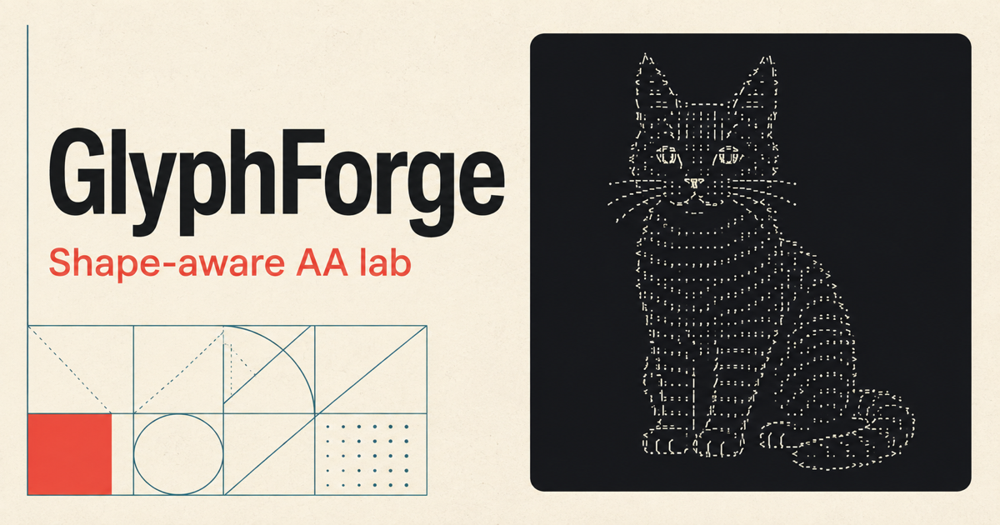

# GlyphForge — Shape-aware ASCII Art Lab

[](https://github.com/yasut0ra/GlyphForge/actions/workflows/ci.yml)
[](LICENSE)

自然言語またはアップロード画像から、glyphの**形**を比較して ASCII Art / AA を作るローカルMVPです。LLMに完成AAを直接書かせず、Visual Planと参照線画を経由し、最終AAを固定幅フォントで再描画して損失を最適化します。



## 主な特徴

- 自然言語をVisual Planへ変換し、LLMに最終AAを直接生成させない設計
- glyph画像のpixel・density・edge・orientationを使った形状マッチング
- 同梱フォント・共通ベースラインで再描画し、複数解像度の損失と局所差分探索で改善
- Pure ASCII / Unicode AA / Block Artを切り替え可能
- APIキーなしでも画像アップロードとローカル参照線画でend-to-end実行可能
- 共通描画設定のCanvas画像を評価し、最大2回のfeedback refinement
- 貼り付け先の行間を生成前に指定し、指定幅を保ったテキストとPNGをコピー

## クイックスタート

必要環境は Python 3.11+ と Node.js 22.13+ です。AA用のDejaVu Sans Monoはリポジトリに同梱しています。

```bash
make setup
```

ターミナルを2つ開き、APIとWeb UIを起動します。

```bash
make api
```

```bash
make web
```

ブラウザで `http://localhost:3000` を開きます。画像生成APIがなくても、画像アップロードからの変換と、猫・宇宙船・アニメ人物などのオフライン参照線画デモが動作します。

ポートや公開URLを変える場合は `frontend/.env.local` に `NEXT_PUBLIC_API_URL` と `NEXT_PUBLIC_SITE_URL` を設定できます（例は `frontend/.env.example`）。

## Architecture

```text
自然言語 / アップロード画像
        │
        ▼
Visual Planner ── structured VisualPlan
        │
        ▼
ImageGenerationProvider ── high-contrast reference
        │
        ▼
render contract + preprocessing ── shared font / baseline / target profile
        │
        ▼
GlyphLibrary ── raster patch / density / edge / orientation
        │
        ▼
initial matcher ── per-cell top-k glyph candidates
        │
        ▼
monospace re-render ── reconstruction loss
        │
        ▼
CoordinateOptimizer ── exact local deltas / optional joint replacements
        │
        ▼
optimized AA + rendered preview + metrics
        │
        ▼
browser capture → ScreenshotEvaluator → feedback-guided refinement (最大2回)
```

```text
frontend/                     Vinext / Next.js-compatible React / TypeScript / Tailwind
backend/
  app/
    api/                      FastAPI routes only
    planner/                  LLMProvider + local/OpenAI planners
    image_generation/         replaceable reference-image providers
    glyphs/                   shared render contract, baseline glyphs, descriptors
    renderer/                 preprocessing, matching, re-rendering, loss
    optimizer/                exact-delta coordinate search / legacy comparison
    evaluator/                SemanticEvaluator + ScreenshotEvaluator（local/OpenAI）
    models/                   API schemas
    service.py                end-to-end orchestration
  config/charsets.json        style/detail-specific configurable charsets
  tests/
  scripts/benchmark.py       offline controlled ablation
frontend/lib/render-contract.json  Python/TypeScript共通の描画仕様
frontend/public/fonts/       同梱AAフォントとライセンス
docs/design-v2.md             設計判断と制約
```

API routeには画像処理を置かず、route → pipeline service → domain modules の順に責務を分離しています。`Optimizer` は simulated annealing / genetic algorithm / MCTS / discrete diffusion へ、3つのprovider interfaceは別実装へ差し替えられます。

## Algorithm (v2)

生成・表示・コピー・再評価で同じ文字配置を扱う設計へ変更しました。詳しい判断と比較条件は [設計メモ](docs/design-v2.md) を参照してください。

1. **Shared render contract**: DejaVu Sans Monoを同梱し、全glyphを共通ベースラインに配置。Code / Terminalは12×24px、Notes / Docsは12×30pxのセルを使用します。
2. **Preprocessing**: 透明背景を白へ合成し、参照画像を正規化。指定の列数とセル比率から行数を決めます。初回生成と改善は同一の参照画像を使います。
3. **Initial matching**: pixel、edge、位置を保つorientation、3×3/9×9平滑化画像を使って候補を作成します。Unicodeは同梱フォントの単一セルglyphに限定し、除外文字は通知します。
4. **Optimization**: ターゲットに固定した正規化を使い、置換の影響範囲だけを再評価。局所差分は全画像のloss差分と一致し、改善する変更だけを採用します。Detailed・feedbackでは隣接2文字の同時探索も試します。
5. **Metrics**: reconstruction loss、Edge F1、11×11 box-window SSIM、実行時間、文字数、accepted moves、passesを表示します。Structure scoreは画像との構造一致であり、意味的な認識精度ではありません。

輪郭の少ない濃淡画像では、glyphの網点を過剰に罰しないようedge/orientationからshape/toneへ重みを移します。旧損失と新損失は尺度が違うため、数値を直接比較しないでください。

`Copy AA`は外側の共通余白だけを除去し、内部空白と文字を保持します。コピー時の1.32倍列複製は廃止しました。貼り付け先でも等幅フォント・折り返しなしが必要です。Notes / Docsは広めの行間のプリセットであり、どのアプリでも書式が保持される保証はありません。画像として同じ形を共有する場合は`Copy PNG`を使用します。

## AI API設定（任意）

```bash
cp backend/.env.example backend/.env
```

`backend/.env` に以下を設定します。バックエンド本体がこのファイルを自動で読み込むため、`make api`で起動すれば`source .env`は不要です。

```dotenv
OPENAI_API_KEY=...
OPENAI_PLANNER_MODEL=gpt-5.4-mini
OPENAI_IMAGE_MODEL=gpt-image-1
OPENAI_EVALUATOR_MODEL=gpt-5.4-mini
```

- `OPENAI_API_KEY` あり: Responses APIのStructured OutputsでVisual Planを作り、画像未指定時はImages APIで参照線画を生成します。
- Screenshot改善では、ブラウザと同じfont/line-heightでCanvasへ再描画したAAと参照画像をマルチモーダル評価します。評価器はAAを直接書き換えず、構造化されたスコア・問題領域・改善指示だけを返します。
- キーなし: local heuristic planner + offline procedural line artを使います。
- 画像アップロードあり: 画像生成providerを使わず、その画像から後続処理を実行します。
- 外部APIに失敗した場合もローカルproviderへフォールバックします。

キーはバックエンドだけに置き、`NEXT_PUBLIC_` 変数には入れないでください。実装は公式の [Responses API](https://developers.openai.com/api/reference/resources/responses/methods/create) と [GPT Image 1](https://developers.openai.com/api/docs/models/gpt-image-1) の仕様に沿っています。

## API

FastAPIの対話ドキュメントは `http://localhost:8000/docs` です。

```text
GET  /api/health
POST /api/plan       multipart: prompt, width, style, detail
POST /api/generate   multipart: prompt, width, style, detail, render_profile?, image?
POST /api/evaluate-screenshot  multipart: plan, screenshot, reference
POST /api/refine               multipart: aa, width, style, detail, render_profile?, round_number, feedback, reference
```

`style` は `pure_ascii | unicode | block`、`detail` は `simple | normal | detailed` です。幅は20〜120文字、画像は12MBまでです。

`render_profile` は `monospace`（既定）または `notes_docs`。レスポンスの `render_spec` と `style` / `detail` を保持し、改善時も同じ値を送信してください。v1で生成した文字列は行数やcharsetが異なるため、v2で再生成してください。

```bash
curl -X POST http://localhost:8000/api/generate \
  -F 'prompt=宇宙船をレトロなASCII Artで' \
  -F 'width=60' \
  -F 'style=pure_ascii' \
  -F 'detail=normal'
```

## Verification

```bash
make test
cd frontend && npm run lint
cd ..
make build
make benchmark
```

テストは共通ベースライン、幅・charset制約、透明画像、局所差分と全体lossの一致、空白への崩壊防止、コピーの空白保持、API経由の生成・改善を検証します。外部AI APIは呼びません。

ベンチマークは幅40の12条件で、同じフォント・参照画像の下で旧matcher/loss/searchと新方式を比較します。`work/benchmark-v2/`へ数値と比較画像を出力します。実測値と限界は [比較レポート](docs/benchmark-v2.md)、設計判断は [設計メモ](docs/design-v2.md) に記載しています。

UIの「描画を評価して2回改善」は、baselineを評価した後、問題領域を優先したglyph候補拡張と局所探索を最大2回行います。各候補を同じ設定でCanvasに再描画し、reconstruction lossが改善し、再現可能な構造評価・edge・SSIMの複合スコアが許容範囲内にある候補だけを採用します。DOMや貼り付け先の実画面を撮影する機能ではありません。VLMの絶対スコアは候補間で揺れる可能性があるため、意味的な指摘と重点領域の決定に使い、採否判定とは分離しています。

## MVPの制約と今後の改善

- 外部アプリの比例フォント、font fallback、空白除去や折り返しはプレーンテキストから制御できません。アプリ内でもPillowとブラウザのアンチエイリアスには差があります。
- SSIMはbox-window版です。標準的なGaussian-window版との差があり、背景の多い画像では高く出るため、Edge F1や実際の見た目と併せて評価します。
- initial matchingをlandmark-awareにし、顔・目・輪郭の重みを別々に最適化できます。
- 評価用の被写体・幅・貼り付け先を増やし、人間による品質比較を追加する必要があります。隣接文字の同時探索は拡張ポイントですが、今回の通常線画では追加効果を確認できていません。
- CLIP/SigLIP/VLM evaluator、aesthetic model、complexity penaltyを統合し、複数目的Pareto探索にできます。
- glyph間の連結性、左右対称prior、負の空間、行間をglobal constraintsとして追加できます。
- 生成結果の保存、seed固定、custom charset編集、複数候補比較は次のUI拡張候補です。

## Contributing / Security

開発への参加方法は [CONTRIBUTING.md](CONTRIBUTING.md)、脆弱性の非公開報告方法は [SECURITY.md](SECURITY.md) を参照してください。

## License

[MIT License](LICENSE)。同梱フォントは [DejaVuのライセンス](frontend/public/fonts/LICENSE-DejaVu.txt) に従います。
